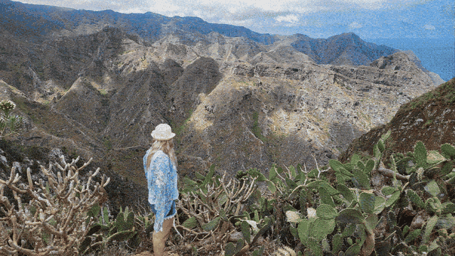
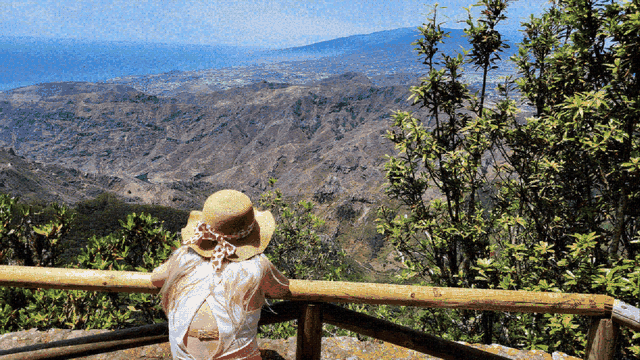
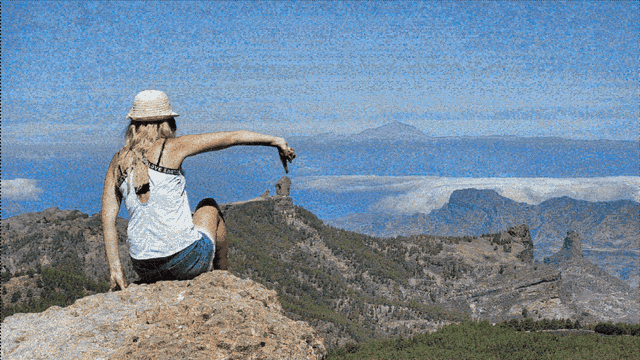
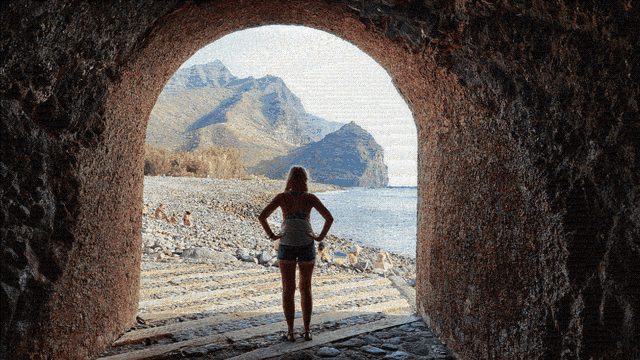
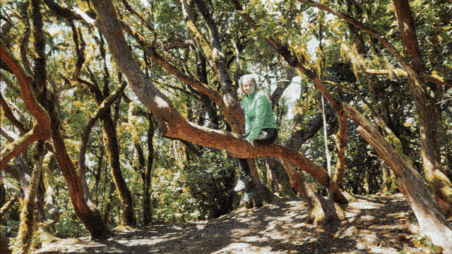
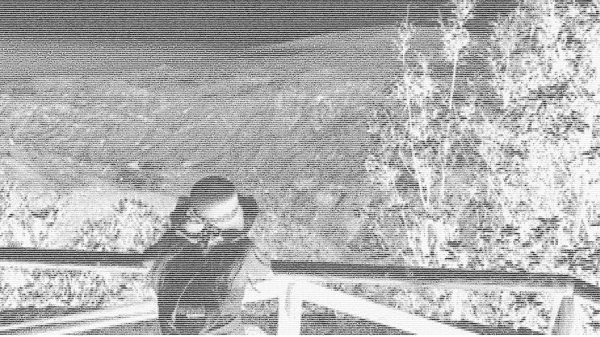
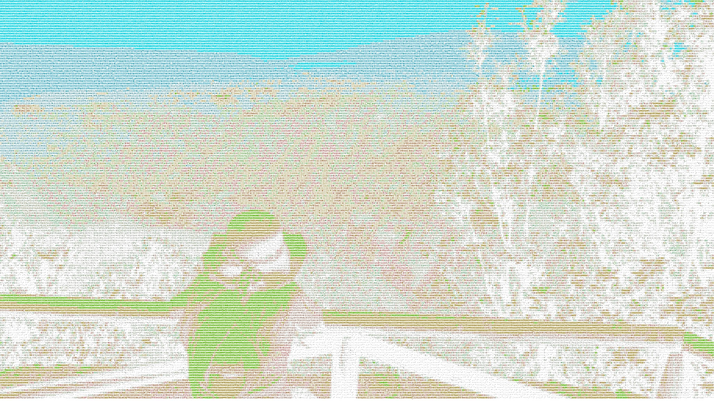
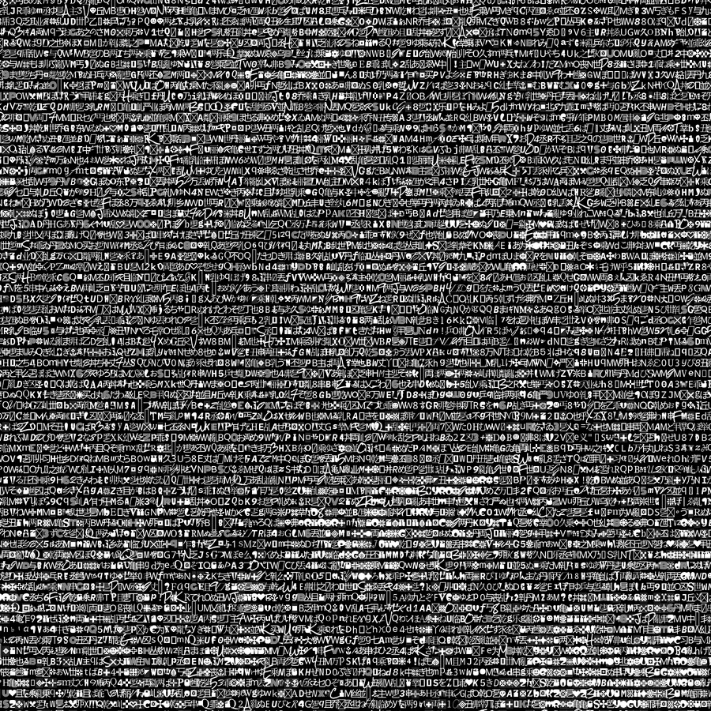

# NeuroMosaic

> Turn any photograph into a high-resolution mosaic — assembled from thousands of real images or typographic glyphs. Desktop app with real-time preview.


---

## Live Demo

**[Open Interactive Viewer](https://piotr1686.github.io/Neural-Mosaic/)** — zoom into 8K mosaics in your browser (OpenSeadragon · keyboard: `1`/`2` switch · `H` reset · `F` fullscreen)

---

## Gallery

### Smart Photo Mosaic

<p align="center">
  
  
  
</p>

<p align="center">
  <em>Left: source image · Center: square tiles · Right: triangle tiling</em>
</p>

<p align="center">
  
</p>

<p align="center">
  <em>Hexagon tiling — same portrait, honeycomb geometry</em>
</p>

<details>
<summary>🔍 Tile detail — click to expand</summary>
<p align="center">
  
  
  
</p>
</details>

### Zoom animations — 6 tile shapes

<table>
  <tr>
    <td align="center"><b>Rectangle</b><br></td>
    <td align="center"><b>Square (mirrored)</b><br></td>
    <td align="center"><b>Hexagon</b><br></td>
  </tr>
  <tr>
    <td align="center"><b>Brick Wall</b><br></td>
    <td align="center"><b>Triangle</b><br></td>
    <td align="center"><b>Hexagon-Romb</b><br></td>
  </tr>
</table>

<p align="center"><em>Zoom-in animation — 454 857 tiles, 16K output. Same source photo, six tile geometries.</em></p>

### Output resolution comparison — same source, same tile shape

<table>
  <tr>
    <td align="center">
      <b>2K</b> — 1 920 × 1 080 px<br>
      
    </td>
    <td align="center">
      <b>4K</b> — 3 840 × 2 160 px<br>
      
    </td>
  </tr>
  <tr>
    <td align="center">
      <b>8K</b> — 7 680 × 4 320 px<br>
      
    </td>
    <td align="center">
      <b>16K</b> — 15 360 × 8 640 px<br>
      
    </td>
  </tr>
</table>

<p align="center"><em>Tile size: 75 px — higher resolution means more tiles and finer detail. Square mirror shape, blend 20%, tint 20%.</em></p>

### Symbol Mosaic

<p align="center">
  
  
</p>

<details>
<summary>🔍 Glyph detail — click to expand</summary>
<p align="center">
  
</p>
</details>

<p align="center">
  
</p>

<p align="center"><em>Glyphs resolve into recognisable characters as you zoom in — 16K output, black-on-white mode.</em></p>

---

## Symbol Mosaic Gallery

Neural-Mosaic includes a **typographic rendering engine** that replaces pixels with glyphs from 120 fonts spanning 7 thematic groups — from Latin monospace to CJK scripts, Ancient hieroglyphs, mathematical symbols and more. Each mode produces a visually distinct aesthetic.

### Two modes showcased

<table>
  <tr>
    <td align="center">
      <b>Black on White</b><br>
      <br>
      <i>Editorial aesthetic — readable, professional.</i>
    </td>
    <td align="center">
      <b>Color on White</b><br>
      <br>
      <i>Vivid palette — each glyph tinted to match the source hue.</i>
    </td>
  </tr>
  <tr>
    <td colspan="2" align="center">
      <br>
      <i>Tile detail — individual glyphs visible at this zoom level.</i>
    </td>
  </tr>
</table>

### Zoom animation


*Watch glyphs resolve into recognisable characters as you zoom in — 16K output, black-on-white mode.*

### Controls

| Parameter | Options | Effect |
|---|---|---|
| Font Groups | CJK · Ancient · Symbols · Latin · Decorative · Handwriting · Other | Visual aesthetic family |
| Style Mode | `black_on_white` · `white_on_black` | Background + glyph fill strategy |
| Symbol Size | 0.5× · 0.75× · 1.0× · 1.75× · 2.0× | Glyph grid density |

### Font library (bundled with the repo)

All fonts are included in `assets/fonts/`. No separate download required — fonts are distributed under SIL Open Font License 1.1 or Apache License 2.0. Full license texts are in `assets/fonts/licenses/`.

Font groups:
- **CJK** — NotoSans/Serif JP/SC/KR/TC, Sawarabi Mincho, MPLUS1p, and more
- **Ancient & Exotic Scripts** — Egyptian Hieroglyphs, Cuneiform, Runic, Linear A/B, Phoenician, Ogham, and more
- **Symbols & Geometric** — NotoSansMath, NotoMusic, NotoEmoji, Yarndings
- **Latin Clean** — NotoSans family, IBM Plex Mono, JetBrains Mono, Inconsolata, Space Mono
- **Decorative / Display** — Creepster, Monoton, Matemasie, BitcountPropDouble variants, Danfo, Splash
- **Handwriting / Script** — DancingScript, Sacramento, Tangerine, Allura, PinyonScript
- **Other** — Arabic, Bengali, Sinhala, Amiri, Tajawal

---

### GUI Demo

<p align="center">
  
</p>

---

## Quick Start

```bash
git clone https://github.com/Piotr1686/Neural-Mosaic.git
cd Neural-Mosaic
pip install -r requirements.txt
python -m src.gui
```

> **GPU acceleration:** For CUDA support, install the matching [PyTorch build](https://pytorch.org/get-started/locally/) first.
> **Symbol Mosaic:** Place `.ttf` / `.otf` fonts in `assets/fonts/` before use. Free CJK fonts: [Noto Fonts](https://fonts.google.com/noto).

---

## Features

NeuroMosaic is a standalone desktop tool with two independent creative engines, both accessible from a single dark-themed GUI. Load an image, configure a handful of options, and click **Render** — the application handles the rest in a background thread while keeping the interface fully responsive.

### Smart Photo Mosaic

Reconstructs the target image by tiling it with photographs from your personal library. Matching is performed in **CIE-LAB colour space** using a 5×5 regional grid per tile, which preserves both overall hue and local colour transitions. A `cKDTree` index allows the engine to search hundreds of thousands of candidates in milliseconds.

**What you can control in the GUI:**

| Control | Options |
|---|---|
| Output resolution | 2K · 4K · 8K · **16K** |
| Tile size multiplier | 0.5 · 0.75 · 1.0 · 1.75 · 2.0 |
| Tile shape | `square` · `rectangle_3x1` · `brick_wall` · `hexagon` · `hexagon_romb` · `romb` · `triangle` · `kite` |
| Allow Mirroring | Horizontally flips tiles on the fly, doubling the effective library size without using extra disk space |
| Black Borders (Grout) | Adds a dark gap between tiles — simulates real mosaic grout lines |
| Color Blend | 0%–30% — blends the original photo over the mosaic for softer colour transitions |
| Tile Tint | 0%–40% — shifts each tile's colours toward the target sector mean for tighter colour accuracy |

The `kite` shape arranges tiles in a distinctive non-rectangular diamond geometry.

**Anti-repetition system:** The engine enforces a hard neighbour constraint (no tile from the same source image may touch another) combined with a frequency penalty that gradually discourages reuse of popular tiles across the entire composition. Together these prevent any single photograph from dominating the output.

---

### Symbol Mosaic (Typo)

Reconstructs the target image using typographic glyphs instead of photographs. Each cell is replaced by a character whose **ink density** best matches the local brightness of the source image. The glyph set spans standard Latin/ASCII characters and **CJK Unicode blocks** (Chinese Hanzi, Japanese Hiragana & Katakana, Korean Hangul), giving the output a distinctive East Asian aesthetic when desired.

**What you can control in the GUI:**

| Control | Options |
|---|---|
| Output resolution | 4K · 8K · **16K** |
| Symbol size multiplier | 0.5 · 0.75 · 1.0 · 1.75 · 2.0 |
| Style mode | `black_on_white` · `white_on_black` |

Font scanning is triggered from the GUI with a single click. Any `.ttf` or `.otf` fonts placed in `assets/fonts/` are indexed automatically.

---

### Tile Library Browser

The **Tile Library** tab lets you inspect, filter, and curate the tile collection before rendering.

| Feature | Details |
|---|---|
| Thumbnail grid | Lazy-loaded 120 px previews, cached on first load — instant on repeat visits |
| Filters | **Lightness** (Dark / Mid / Bright), **Texture** (Flat / Textured), **Filename** substring |
| Sort | Name A–Z / Z–A, Newest first, Oldest first |
| LAB Coverage Map | matplotlib popup: a\*–b\* hex-bin gamut coverage + PCA diversity scatter for the full index |
| Tile selection | Click any tile to mark it (purple highlight); click again to deselect |
| Export Bad Tiles | Saves selected filenames to `data/library_*/excluded.txt` — idempotent, safe to re-run |

`excluded.txt` is read by future index rebuilds to skip known-bad tiles without deleting the originals.

---

### Real-time Preview

Both the **Smart Photo Mosaic** and **Symbol Mosaic** tabs have a live preview pane on the right side. The preview renders automatically 300 ms after any setting change — tile shape, scale, blend, border, mode, variation, or font group — with no manual trigger required.

- Preview resolution: 512 px on the short edge (fast; full-resolution render is unchanged)
- Multiple rapid changes are debounced: only the final state triggers a render
- Preview activates as soon as both an input image and a loaded index are available

---

## Use Cases

NeuroMosaic is built for projects that demand both photographic detail *and* physical-print scale. Three scenarios where the app delivers immediate value:

### Personalised Keepsake Prints — Weddings, Anniversaries, "First Year"

Turn a portrait of a couple, a child, or a jubilarian into a 16K mosaic assembled from 2,000–5,000 of their **own** photos — phone archives, social-media exports, family albums. Printed at 100×150 cm on canvas, the portrait reads across the room, while every tile up close is a real memory.

> **Why it works:** the anti-repetition engine guarantees no single photograph dominates the composition, and the `kite` tile shape gives the print a distinctly non-rectangular, gallery-ready geometry.

### Brand & Campaign Visuals — Hero Images from Product or UGC Libraries

Build a campaign hero — logo, ambassador portrait, or key brand symbol — from a product catalogue or user-generated content (e.g. an Instagram contest). Export at 16K for billboards and annual-report covers; downscale the same render to 4K for reels, web banners, and social posts. One source render → every channel.

> **Why it works:** `Tile Tint (0–40%)` nudges tile colours toward the brand palette without erasing the recognisability of each source image; `Color Blend (0–30%)` produces a softer variant ready for use as a background layer.

### Typography Wall Art — Schools, Bookstores, Cafés, Museums

Use the Symbol Mosaic engine to compose literary or educational posters: a portrait of an author or historical figure assembled entirely from glyphs — 50,000 Hanzi forming Murakami, the letters of a sonnet forming Shakespeare. `black_on_white` delivers a classic editorial look; `white_on_black` suits dark-themed modern interiors.

> **Why it works:** zero library cost (fonts replace thousands of photos), CJK Unicode coverage is built in, and 16K output holds up at A0 print size and beyond.

---

## How It Works

### Smart Engine — colour matching

Every tile in the library is represented as a **75-dimensional feature vector**: a 5×5 grid of cells, each described by its mean LAB (L\*, a\*, b\*) values. This captures both the dominant colour and the spatial colour gradient across the tile. At render time a `cKDTree` finds the nearest neighbours for each sector of the target image in milliseconds, even with 300,000+ tiles indexed.

### Typo Engine — brightness matching

Each glyph is pre-rendered at the target tile size and its **normalised ink density** (fraction of dark pixels) is computed and stored. At render time the engine maps each cell's mean brightness to the closest glyph by density, then renders it in the chosen style mode.

### Anti-repetition (Smart Engine)

- **Hard constraint:** A tile's source file may not appear in any of the 4 direct neighbours of the current cell.
- **Frequency penalty:** Each use of a source file increments a global counter. The penalised score is `raw_score + (usage_count × W_FREQ)`, which continuously pushes the engine toward less-used tiles.
- Both constraints treat all mirrored variants of the same image as a single source identity.

---

## Architecture

Neural-Mosaic follows a modular pipeline: a polite multi-source downloader builds the tile library, a feature indexer encodes each tile into a 75-dimensional LAB descriptor, and the rendering engine matches sectors of the target image to the closest tiles using `cKDTree` nearest-neighbour search.

Full module dependency graph: [docs/ARCHITECTURE.md](docs/ARCHITECTURE.md)

---

## Building the Tile Library

The included async downloader fetches public-domain artwork (Chicago Art Institute API) and Creative Commons images:

```bash
python -m src.fast_downloader
```

After downloading, run the image optimizer to normalise sizes and remove corrupt files:

```bash
python -m src.optimizer
```

Place your own photos directly in `data/library_private/tiles/` — they are indexed alongside the public library without any additional steps.

---

## Configuration

Copy `.env.example` to `.env` and adjust values for your setup:

```bash
cp .env.example .env
```

Key settings:

| Variable | Default | Description |
|---|---|---|
| `TILE_SIZE` | `75` | Base tile size in pixels |
| `TARGET_SHORT_SIDE` | `18000` | Output short side in pixels (16K ≈ 18000) |
| `USE_CUDA` | `True` | Enable CUDA GPU acceleration |
| `GHOSTING_OPACITY` | `0.25` | Overlay opacity (0.0 = pure mosaic) |
| `NUM_TILES` | `300000` | Maximum tiles loaded from index |

---

## Workflow Inside the GUI

### Smart Photo Mosaic

1. **Sidebar → "Update / Create Index"** — scans `data/library_public/tiles/` (and `data/library_private/tiles/` if present) and builds `data/smart_index.pkl`. Run once after adding new photos; subsequent loads take seconds.
2. **Sidebar → "Load Smart Index"** — loads the pre-built index into memory.
3. **Tab: Smart Photo Mosaic** — select your input image, choose resolution, tile shape, and rendering options.
4. **Sidebar → "Set Output Folder"** + optionally enter a **Project Name**.
5. Click **RENDER SMART MOSAIC**. Progress is logged live in the sidebar console. The file is saved automatically as `<ProjectName>_Smart_<timestamp>.jpg`.

### Symbol Mosaic (Typo)

1. **Tab: Symbol Mosaic → "Update Database (Scan Assets)"** — indexes all fonts in `assets/fonts/`. Run once after adding new fonts.
2. **"Load Typo Index (Fast)"** — loads the font index. The status label shows how many symbols are ready.
3. Select your input image, choose resolution, symbol size, font groups, and style mode. The **PREVIEW** pane on the right updates automatically 300 ms after any change.
4. Click **RENDER SYMBOL MOSAIC**. The file is saved as `<ProjectName>_Symbol_<timestamp>.png`.

### Tile Library

1. **Tab: Tile Library → Refresh** — scans all library directories and loads thumbnails lazily. Thumbnails are cached in `data/.thumbs/`; second load is instant.
2. Use the filter bar to narrow by **Lightness**, **Texture**, or filename substring. The counter shows how many tiles match out of the total.
3. Click **LAB Coverage Map** to open a matplotlib window showing the colour gamut of your indexed library (a\*–b\* hex-bin) alongside a PCA diversity scatter.
4. Click any tile to **select** it (purple highlight); click again to deselect. When at least one tile is selected, the **Export Bad Tiles...** button becomes active.
5. Click **Export Bad Tiles...** — selected filenames are appended to `data/library_*/excluded.txt` and will be skipped on the next index rebuild. The operation is idempotent.

---

## CLI Usage

For headless rendering, scripted pipelines, or batch jobs, Neural-Mosaic ships a command-line interface in `src/cli.py`. Both engines and all GUI options are exposed; the prerequisites (a built index and a tile/font library) are identical to the GUI.

### `render` — single image

```bash
# Smart photo mosaic at 8K, default square tiles
python -m src.cli render input/portrait.jpg --engine smart --res 8K

# Smart mosaic at 16K with hexagon tiles, soft colour blend, mirror disabled
python -m src.cli render input/portrait.jpg --engine smart --res 16K \
  --shape hexagon --blend 0.2 --tint 0.15 --no-mirror

# Symbol mosaic at 8K, white-on-black, restricted to CJK + Symbol fonts
python -m src.cli render input/portrait.jpg --engine typo --res 8K \
  --mode white_on_black --font-groups A_cjk C_symbols
```

Outputs default to `output/<stem>_<engine>_<res>_<timestamp>.{jpg|png}`. Override with `--output PATH`.

### `batch` — whole folder, idempotent

```bash
# Render every *.jpg in ./input/ to ./output/ at 4K
python -m src.cli batch ./input ./output --engine smart --res 4K

# Custom glob pattern
python -m src.cli batch ./input ./output --engine smart --res 8K --pattern '*.png'
```

Batch output names are **timestamp-free** — `{stem}_{engine}_{res}_{shape|mode}.ext` — so re-running the same command skips already-rendered files instead of re-doing the work. Failed renders are logged and the run exits with code `1`.

### Common options

| Option | Engine | Default | Notes |
|---|---|---|---|
| `--engine {smart,typo}` | both | required | Which renderer to use |
| `--res {2K,4K,8K,16K}` | both | `8K` | Output resolution |
| `--index PATH` | both | `data/<engine>_index.pkl` | Override pre-built index location |
| `--shape SHAPE` | smart | `square` | `square` · `rectangle_3x1` · `brick_wall` · `hexagon` · `hexagon_romb` · `romb` · `triangle` · `kite` |
| `--scale FLOAT` | both | `1.0` | Tile size multiplier (0.5–2.0) |
| `--blend FLOAT` | smart | `0.0` | Original-over-mosaic blend, 0.0–0.3 |
| `--tint FLOAT` | smart | `0.0` | Tile tinting toward sector colour, 0.0–0.4 |
| `--border` | smart | off | Add dark grout lines between tiles |
| `--no-mirror` | smart | mirroring on | Disable horizontal tile mirroring |
| `--edge-aware` | smart | off | Require 79-dim edge-feature index |
| `--mode {black_on_white,white_on_black}` | typo | `black_on_white` | Symbol render mode |
| `--font-groups GROUP ...` | typo | all | Limit to subset: `A_cjk` · `B_ancient` · `C_symbols` · `D_latin_clean` · `E_decorative` · `F_handwriting` · `G_uncategorized` |
| `--variation INT` | typo | `20` | Glyph density window |
| `--verbose` | both | off | Debug-level logging |

Logs are written to `logs/cli.log` in addition to stdout. Run `python -m src.cli --help` (or `render --help` / `batch --help`) for the full reference.

---

## Project Structure

```
Neural-Mosaic/
├── src/
│   ├── gui.py              # Entry point — CustomTkinter application (3 tabs)
│   ├── engine_smart.py     # Colour-matched photomosaic engine (LAB + cKDTree)
│   ├── engine_typo.py      # Typography / glyph mosaic engine
│   ├── preview.py          # PreviewRenderer — 300 ms debounced background render
│   ├── cli.py              # Headless CLI: render + batch subcommands
│   ├── indexer_smart.py    # Builds data/smart_index.pkl
│   ├── indexer_typo.py     # Builds data/typo_index.pkl
│   ├── font_groups.py      # Font group definitions for typo engine
│   ├── downloader_v2.py    # Async public-domain image fetcher
│   ├── optimizer.py        # Image normalisation & cleanup
│   ├── ai_core.py          # MiDaS depth model (retained for future depth-aware features)
│   └── config.py           # Settings dataclass (reads .env)
├── assets/
│   ├── fonts/              # Place .ttf / .otf fonts here
│   └── examples/           # Example mosaics and source images
├── data/
│   ├── library_public/tiles/
│   ├── library_private/tiles/
│   └── .thumbs/            # Thumbnail cache (generated at runtime, not in repo)
├── tests/
├── .env.example            # Configuration template
├── .gitignore
├── CONTRIBUTING.md
├── Makefile
└── requirements.txt
```

---

## Requirements

- Python 3.10+
- PyTorch (CPU or CUDA)
- `customtkinter`, `Pillow`, `numpy`, `scipy`, `scikit-image`, `tqdm`

Full list: `requirements.txt`

---

## Performance

Benchmarked on: i5-12500H · RTX 3050 Laptop 4 GB · 32 GB DDR4

| Operation | GPU (CUDA) | CPU only |
|---|---|---|
| Index 10,000 tiles | 14.8 s | 14.8 s |
| Index 50,000 tiles | 1.2 min | 1.2 min |
| Render 4K · square tiles | 32.1 s | 32.1 s |
| Render 8K · hexagon tiles | 2.4 min | 2.4 min |
| Render 16K · kite tiles | — | — |
| Symbol mosaic 8K · B&W | 11.9 s | 11.9 s |
| Peak VRAM | ~0 GB † | N/A |
| Peak RAM | 0.58 GB | 0.58 GB |

> † SmartEngine and TypoEngine run on CPU — VRAM usage is near zero. Run `python -m tests.benchmark` to generate values for your hardware.

---

## Print Size Guide

The table below shows the maximum recommended print dimensions for each output resolution at two common print DPI settings.

| Resolution | Pixels | @ 300 DPI (photo quality) | @ 150 DPI (large format) | Best for |
|---|---|---|---|---|
| **16K** | 16 000 × 9 000 | 135 × 76 cm | 270 × 152 cm | Billboard, large canvas, A0+ poster |
| **8K** | 8 000 × 4 500 | 68 × 38 cm | 135 × 76 cm | A1 poster, medium canvas |
| **4K** | 4 000 × 2 250 | 34 × 19 cm | 68 × 38 cm | A3 framed print |
| **2K** | 2 000 × 1 125 | 17 × 9.5 cm | 34 × 19 cm | A5 insert, digital display |

> Portrait orientations swap width and height. Symbol Mosaic supports 4K / 8K / 16K; Smart Photo Mosaic supports all four.

---

## Development History

NeuroMosaic grew from an iterative design conversation that explored several approaches before arriving at the current architecture:

- **v1–v2:** Semantic matching with OpenAI CLIP (ViT-B/32) — perceptually aware but colour-inaccurate.
- **v3–v4:** Hybrid CLIP + RGB scoring with VGG-19 structural analysis and tile transformations (mirroring, 90°/180°/270° rotation).
- **v5 (current):** Replaced learned embeddings with direct LAB colour matching. This eliminated the GPU memory bottleneck of large neural models while producing sharper colour fidelity. The 5×5 LAB grid preserves the spatial structure awareness that motivated the earlier VGG approach.

Each iteration kept the anti-repetition logic and the multi-shape tile geometry, which remain the most distinctive aspects of the engine.

---

## Roadmap

- [x] Real-time mosaic preview in GUI — 300 ms debounce, 512 px short edge, both tabs
- [x] Tile library browser — thumbnail grid, LAB coverage map, tile selection & exclusion export
- [x] CLI mode for batch processing — see [CLI Usage](#cli-usage)
- [ ] Export to deep-zoom (DZI) with excluded-tile support
- [ ] Plugin system for custom tile shapes

---

## Known Limitations

- 16K rendering requires ~3 GB free RAM (output is not chunked yet — the full canvas is held in memory).
- GUI is Windows-focused. CustomTkinter works on Linux/macOS but the font stack and file-path handling assume Windows.
- Tile Tint uses pixel-wise lerp in RGB space. A LAB-space variant is on the roadmap; current RGB implementation produces visible, predictable results.
- Deep Zoom viewer hosts only 2 mosaics due to GitHub Pages storage constraints.
- CC0/Public Domain licence filter trusts source metadata — rare false positives on user-uploaded content are reported upstream to Openverse.
- Repository size is ~100 MB due to the bundled font library (120 OFL/Apache fonts). Initial clone takes ~30–60 seconds. Fonts are mandatory for Symbol Mosaic — included directly to guarantee zero-friction setup.

---

## Troubleshooting

**Q: Downloader returns 429 Too Many Requests**
A: Wait ~1 hour. The Starter tier works without an API key. For Gallery / Extended access, register a key (see `.env.example`).

**Q: 16K render fails or crashes**
A: Close other applications. At least ~3 GB free RAM is required. As an alternative, render at 8K.

**Q: WARNING about incompatible index**
A: Click **"Update / Create Index"** in the GUI to rebuild `smart_index.pkl`.

**Q: Preview pane shows "Select image and load index"**
A: Both conditions must be met: (1) click "Select Input Image" in the settings column, and (2) load the index via the sidebar (Smart) or "Load Typo Index" button (Symbol Mosaic). The preview fires automatically once both are ready.

---

## Contributing

Contributions, issues, and feature requests are welcome.
See [CONTRIBUTING.md](CONTRIBUTING.md) for development setup and guidelines.

---

## Acknowledgements

- [Art Institute of Chicago API](https://api.artic.edu/) — public domain artwork for the default tile library
- [CustomTkinter](https://github.com/TomSchimansky/CustomTkinter) — modern dark-themed GUI framework

---

## License

MIT — use it, fork it, build on it.
