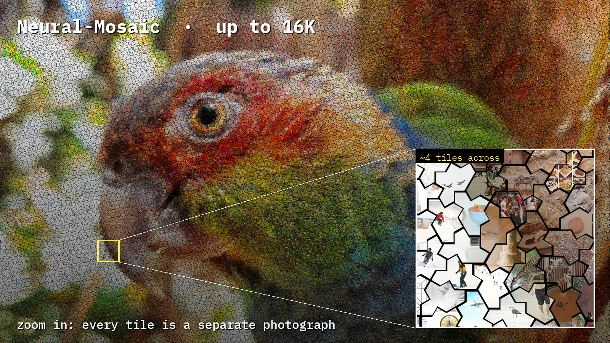
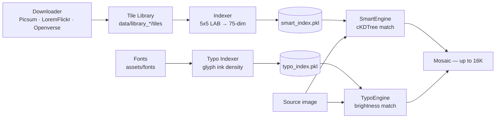

# Neural-Mosaic

[English](README.md) · **Polski**

> Zamień dowolne zdjęcie w mozaikę o wysokiej rozdzielczości — złożoną z tysięcy prawdziwych obrazów lub glifów typograficznych. Aplikacja desktopowa, render do 16K, z ręcznym podglądem na żądanie.


<p align="center">
  
</p>
<p align="center">
  <em>Pojedyncze zdjęcie, odtworzone z tysięcy innych — tutaj na chiralnym, aperiodycznym monokafelku <strong>spectre</strong> z czarną fugą.</em>
</p>

<p align="center">
  <a href="https://piotr1686.github.io/Neural-Mosaic/viewer.html"><strong>🔍 Otwórz galerię z zoomem na żywo →</strong></a><br/>
  <sub>przybliżaj od całego portretu aż do pojedynczego kafelka · prawdziwe mozaiki 16K · prosto w przeglądarce</sub>
</p>

---

## Spis treści

- [Demo na żywo](#demo-na-żywo)
- [Galeria](#galeria)
- [Szybki start](#szybki-start)
- [Funkcje](#funkcje)
- [Najciekawsze rozwiązania techniczne](#najciekawsze-rozwiązania-techniczne)
- [Zastosowania](#zastosowania)
- [Jak to działa](#jak-to-działa)
- [Architektura](#architektura)
- [Budowanie biblioteki kafelków](#budowanie-biblioteki-kafelków)
- [Konfiguracja](#konfiguracja)
- [Praca w GUI](#praca-w-gui)
- [Użycie CLI](#użycie-cli)
- [Struktura projektu](#struktura-projektu)
- [Wymagania](#wymagania)
- [Wydajność](#wydajność)
- [Przewodnik rozmiarów wydruku](#przewodnik-rozmiarów-wydruku)
- [Historia rozwoju](#historia-rozwoju)
- [Plany rozwoju](#plany-rozwoju)
- [Znane ograniczenia](#znane-ograniczenia)
- [Rozwiązywanie problemów](#rozwiązywanie-problemów)
- [Współpraca](#współpraca)
- [Podziękowania](#podziękowania)
- [Autor](#autor)
- [Licencja](#licencja)

---

## Demo na żywo

**[Otwórz interaktywną przeglądarkę](https://piotr1686.github.io/Neural-Mosaic/viewer.html)** — przybliżaj prawdziwe mozaiki 16K bezpośrednio w przeglądarce (OpenSeadragon · klawiatura: `1`–`5` przełączanie · `H` reset · `F` pełny ekran). Trzy mozaiki 16K (foto · symbol · spectre) plus dwa kształty 8K.

---

## Galeria

### Smart Photo Mosaic — jeden portret, wiele geometrii kafelków

<p align="center">
  
  
  
</p>
<p align="center"><em>Po lewej: obraz źródłowy · Środek: kafelki kwadratowe · Po prawej: kafelkowanie trójkątne</em></p>

<p align="center">
  
  
</p>
<p align="center"><em>Po lewej: heksagon (plaster miodu) · Po prawej: kite — nieprostokątna geometria rombu na siatce heksagonalnej</em></p>

<details>
<summary>🔍 Detal kafelka — kliknij, aby rozwinąć</summary>
<p align="center">
  
  
  
</p>
<p align="center">
  
  
</p>
</details>

### Monokafelek spectre + czarna fuga — progresywne przybliżanie

**Spectre** to chiralny, aperiodyczny monokafelek ([Smith, Myers, Kaplan, Goodman-Strauss, 2023](https://arxiv.org/abs/2305.17743)) — 14-bok, który pokrywa płaszczyznę wzorem, który *nigdy się nie powtarza*. Czarna fuga sprawia, że geometria jest czytelna: zbliż się, a każdy kafelek rozkłada się na osobne zdjęcie.

> 📖 **Przeczytaj write-up:** [Fotomozaiki na aperiodycznym monokafelku](docs/posts/aperiodic-monotile-mosaic.pl.md) — czym jest spectre, czemu pasuje do mozaiki i jak silnik go kafelkuje.

<table>
  <tr>
    <td align="center"><b>Pełna mozaika</b><br></td>
    <td align="center"><b>Zoom ×2.5</b><br></td>
    <td align="center"><b>Zoom — pojedyncze kafelki</b><br></td>
  </tr>
</table>
<p align="center"><em>Render 16K · monokafelek spectre · czarna fuga · 15% barwienia kafelków.</em></p>

### Porównanie rozdzielczości wyjściowych — to samo źródło, ten sam kształt kafelka

<table>
  <tr>
    <td align="center"><b>2K</b> — 1920 × 1080 px<br></td>
    <td align="center"><b>4K</b> — 3840 × 2160 px<br></td>
  </tr>
  <tr>
    <td align="center"><b>8K</b> — 7680 × 4320 px<br></td>
    <td align="center"><b>16K</b> — 15360 × 8640 px<br></td>
  </tr>
</table>
<p align="center"><em>Rozmiar kafelka 75 px — wyższa rozdzielczość oznacza więcej kafelków i drobniejszy detal. Kształt kwadratowy (z odbiciem), blend 20%, barwienie 20%.</em></p>

### Symbol Mosaic — to samo zdjęcie, siedem grup fontów

Silnik typograficzny odtwarza obraz z glifów, których **gęstość tuszu** odpowiada lokalnej jasności. Każda grupa fontów daje odrębną estetykę — od CJK i czystego monospace po **egipskie hieroglify**, symbole matematyczne i emoji.

<p align="center">
  
</p>
<p align="center"><em>To samo źródło, sześć z siedmiu grup fontów · 16K · czarne na białym. (Siódma grupa, <em>Inne / niesklasyfikowane</em>, jest tu pominięta.)</em></p>

<p align="center">
  
</p>
<p align="center"><em>Ten sam obszar z bliska — CJK, pisma starożytne i pismo odręczne. Każdy glif jest w pełni ukształtowany (bez pustych pól ".notdef"), nawet klinopis i hieroglify.</em></p>

### Symbol Mosaic — rozmiar fontu a czytelność

<p align="center">
  
</p>
<p align="center"><em>Mniejsze glify upakowują gęstszy detal; większe pozostają indywidualnie czytelne. 16K · czarne na białym.</em></p>

<p align="center">
  
</p>
<p align="center"><em>Glify rozkładają się na rozpoznawalne znaki w miarę przybliżania — wyjście 16K, tryb czarne na białym.</em></p>

### Symbol Mosaic — dwa tryby stylu

Ten sam render w obu trybach stylu. `black_on_white` czyta się jak klasyczna typografia redakcyjna; `white_on_black` pasuje do ciemnych, nowoczesnych wnętrz. Przełączysz to z GUI lub flagą `--mode` w CLI.

<p align="center">
  
</p>
<p align="center"><em>Identyczne zdjęcie i grupa fontów (Latin monospace) — różni się tylko tryb stylu. 8K.</em></p>

### Demo GUI

<p align="center">
  
</p>

---

## Szybki start

```bash
git clone https://github.com/Piotr1686/Neural-Mosaic.git
cd Neural-Mosaic
pip install -r requirements.txt
python -m src.gui
```

> **Uwaga o GPU:** silniki mozaiki działają w całości na **CPU** — GPU nie jest wymagane. PyTorch jest używany tylko przez opcjonalny, obecnie uśpiony moduł głębi; zainstaluj odpowiednią [wersję PyTorch](https://pytorch.org/get-started/locally/) tylko jeśli planujesz z nim eksperymentować.
>
> **Fonty do Symbol Mosaic są dołączone** w `assets/fonts/` — nic nie trzeba pobierać. Aby dodać własne, wrzuć pliki `.ttf` / `.otf` i ponownie zeskanuj z GUI.

---

## Funkcje

Neural-Mosaic to samodzielne narzędzie desktopowe z dwoma niezależnymi silnikami kreatywnymi, dostępnymi z jednego GUI w ciemnym motywie oraz z bezgłowego CLI. Wczytaj obraz, skonfiguruj kilka opcji i kliknij **Render** — praca biegnie w wątku w tle, a interfejs pozostaje responsywny.

### Smart Photo Mosaic

Odtwarza obraz docelowy, kafelkując go zdjęciami z Twojej biblioteki. Dopasowanie odbywa się w **przestrzeni barw CIE-LAB** przy użyciu siatki regionalnej 5×5 na kafelek (75 wymiarów), co zachowuje zarówno ogólny odcień, jak i lokalne przejścia kolorów. Indeks `cKDTree` przeszukuje setki tysięcy kandydatów w milisekundach.

| Kontrolka | Opcje |
|---|---|
| Rozdzielczość wyjściowa | 2K · 4K · 8K · **16K** |
| Mnożnik rozmiaru kafelka | 0.5 · 0.75 · 1.0 · 1.75 · 2.0 |
| Kształt kafelka | **50 kafelkowań** — zobacz [pełną listę](#kształty-kafelków) poniżej |
| Zezwól na odbicia (Mirroring) | W locie odbija kafelki w poziomie, podwajając efektywną bibliotekę bez dodatkowego miejsca na dysku |
| Czarne obwódki (fuga) | Dodaje ciemną przerwę między kafelkami — symuluje prawdziwe linie fugi w mozaice |
| Color Blend | 0%–30% — miesza oryginalne zdjęcie na mozaikę, łagodząc przejścia |
| Tile Tint | 0%–40% — przesuwa każdy kafelek ku średniej barwie docelowego sektora dla większej wierności koloru |

Kształt **`kites`** dzieli każdy spłaszczony heksagon na 6 latawców i renderuje każdy latawiec jako osobne zdjęcie (siatka deltoidalna trójheksagonalna). Kształt **`spectre`** kafelkuje obraz ściśle chiralnym, aperiodycznym monokafelkiem — zobacz [Najciekawsze rozwiązania techniczne](#najciekawsze-rozwiązania-techniczne).

#### Kształty kafelków

Wszystkie **50 kafelkowań** dzieli kadr dokładnie — bez dziur i bez nakładek — a każde jest przypięte złotymi testami co do piksela. Jedynym źródłem prawdy jest `SHAPE_MODES` w `src/engine_smart.py`; listę wypiszesz w locie: `python -c "from src.engine_smart import shape_names; print(shape_names())"`.

| Rodzina | Kształty |
|---|---|
| **Kraty** (12) | `square` · `rectangle_3x1` · `brick_wall` · `hexagon` · `hexagon_romb` · `romb` · `triangle` · `stagger_tri` · `scales` · `braid` · `weave` · `moire` |
| **Klasyczne teselacje** (15) | `cairo` · `floret` · `pinwheel` · `trunc_hex` · `trunc_square` · `rhombitrihex` · `pythagorean` · `kites` · `truchet` · `truchet_hex` · `voderberg` · `escher_lizard` · `puzzle_classic` · `puzzle_hex` · `puzzle_ribbon` |
| **Aperiodyczne / kwazikryształy** (6) | `spectre` · `penrose` · `penrose_p2` · `ammann_beenker` · `girih` · `gereh` |
| **Fraktalne** (6) | `sierpinski` · `koch_island` · `koch_snowflake` · `dragon` · `gosper` · `rosette_fractal` |
| **Promieniste i organiczne** (11) | `voronoi` · `pebbles` · `bloom` · `phyllotaxis` · `nautilus` · `rosette` · `poincare` · `sunflower_grande` · `sunflower_grande_inverse` · `sunflower_rings` · `sunflower_soft` |

**System antypowtórzeniowy.** Ograniczenie sąsiedztwa zniechęca do tego, by jakikolwiek kafelek z tego samego źródłowego obrazu stykał się sam ze sobą, w połączeniu z karą częstotliwościową rosnącą wraz z ponownym użyciem kafelka. Razem powstrzymują pojedyncze zdjęcie przed zdominowaniem kompozycji (szczegóły w [Jak to działa](#jak-to-działa)).

### Symbol Mosaic (Typo)

Odtwarza obraz docelowy przy użyciu glifów typograficznych zamiast zdjęć. Każda komórka zostaje zastąpiona znakiem, którego **znormalizowana gęstość tuszu** najlepiej odpowiada lokalnej jasności. Zestaw glifów obejmuje **siedem grup fontów** i szeroki zakres pism Unicode.

| Kontrolka | Opcje |
|---|---|
| Rozdzielczość wyjściowa | 2K · 4K · 8K · **16K** |
| Mnożnik rozmiaru symbolu | 0.5 · 0.75 · 1.0 · 1.75 · 2.0 |
| Tryb stylu | `black_on_white` · `white_on_black` |
| Grupy fontów | CJK · Starożytne · Symbole · Latin · Dekoracyjne · Odręczne · Inne |

Skanowanie fontów to jedno kliknięcie w GUI (lub `python -m src.indexer_typo`). Wszystkie dołączone fonty znajdują się w `assets/fonts/` na licencji SIL Open Font License 1.1 lub Apache License 2.0 (teksty w `assets/fonts/licenses/`).

| Grupa | Kod `--font-groups` | Pisma / fonty |
|---|---|---|
| **CJK** | `A_cjk` | Noto Sans/Serif JP·SC·KR·TC, Sawarabi Mincho, M PLUS — Hanzi, Kana, Hangul |
| **Starożytne i egzotyczne** | `B_ancient` | Hieroglify egipskie i anatolijskie, klinopis, Linear A/B, fenickie, runiczne, ogham, … |
| **Symbole i geometryczne** | `C_symbols` | Noto Math, Music, Emoji, Symbols, Yarndings |
| **Latin Clean** | `D_latin_clean` | Noto Sans, IBM Plex Mono, JetBrains Mono, Inconsolata, Space Mono |
| **Dekoracyjne / display** | `E_decorative` | Creepster, Monoton, Matemasie, Bitcount, Danfo, Splash |
| **Odręczne / pismo ozdobne** | `F_handwriting` | Dancing Script, Sacramento, Tangerine, Allura, Pinyon |
| **Inne** | `G_uncategorized` | Arabski, bengalski, syngaleski, Amiri, Tajawal |

### Przeglądarka biblioteki kafelków

Zakładka **Tile Library** pozwala przejrzeć, filtrować i kuratorsko zarządzać kolekcją przed renderem.

| Funkcja | Szczegóły |
|---|---|
| Siatka miniatur | Leniwie ładowane podglądy 120 px, paginowane (200 na stronę, „Load More"), cache'owane przy pierwszym wczytaniu |
| Filtry | **Jasność** (Dark / Mid / Bright), **Tekstura** (Flat / Textured), fragment **nazwy pliku** |
| Sortowanie | Nazwa A–Z / Z–A, Najnowsze, Najstarsze |
| Mapa pokrycia LAB | Wyskakujące okno matplotlib: pokrycie gamy a\*–b\* (hex-bin) + wykres różnorodności PCA dla całego indeksu |
| Wybór kafelków | Kliknij kafelek, aby go zaznaczyć (fioletowe podświetlenie); kliknij ponownie, aby odznaczyć |
| Eksport złych kafelków | Zapisuje wybrane nazwy plików do `data/library_*/excluded.txt` — idempotentnie, bezpiecznie uruchamiać ponownie |

`excluded.txt` jest odczytywany przy przyszłych przebudowach indeksu, aby pominąć znane złe kafelki bez usuwania oryginałów.

### Ręczny podgląd

Zarówno zakładka **Smart Photo Mosaic**, jak i **Symbol Mosaic** mają panel podglądu po prawej. Podgląd jest **na żądanie**: skonfiguruj opcje, a następnie kliknij **Generate Preview**. Nie ma żadnych automatycznych wyzwalaczy — nic nie renderuje się, dopóki o to nie poprosisz.

- Rozdzielczość podglądu: 512 px na krótszym boku (szybko; pełnorozdzielczościowy render nie jest tym objęty)
- Szybkie powtarzane kliknięcia są debounce'owane (300 ms), więc renderuje się tylko ostatnie żądanie
- Przycisk staje się aktywny po wczytaniu zarówno obrazu wejściowego, jak i indeksu

---

## Najciekawsze rozwiązania techniczne

Kilka części tego projektu było naprawdę nietrywialnych do zbudowania:

- **Aperiodyczne kafelkowanie spectre od zera.** Kształt `spectre` nie da się ułożyć na żadnej regularnej siatce, więc silnik przenosi autorski system podstawień dziewięciu metakafelków (Γ Δ Θ Λ Ξ Π Σ Φ Ψ, w tym „mistyczną" parę Γ), aby obliczyć dokładne kafelkowanie, a następnie umieszcza po jednym zdjęciu na kafelek — każdy spectre o tej samej chiralności, bez odbić. Zobacz `src/spectre_tiling.py`.
- **Maskowanie kafelków niewypukłych.** Kafelki kite i spectre są nieprostokątne; silnik renderuje każde zdjęcie w masce wielokąta i wypełnia obszar zewnętrzny wartością średnią, aby treść sąsiadów nigdy nie przeciekała przez granice kafelków.
- **Typografia dopasowana gęstością w 44 blokach Unicode.** Indekser typo renderuje każdy obsługiwany glif, mierzy jego gęstość tuszu i pomija niezdefiniowane punkty kodowe przez `cmap` fontu, dzięki czemu w wyniku nie pojawiają się puste pola ".notdef" — co czyni czytelnymi nawet mozaiki złożone wyłącznie z hieroglifów czy klinopisu.
- **Bezpieczny współbieżnie podgląd na żywo.** Schemat tokenu generacji plus podwójnie sprawdzany zamek (double-checked lock) na cache sąsiedztwa utrzymują renderowanie podglądu w tle wolne od wyścigów.

---

## Zastosowania

Neural-Mosaic jest zbudowany pod projekty, które potrzebują jednocześnie fotograficznego detalu *i* skali wydruku fizycznego.

### Spersonalizowane wydruki pamiątkowe — śluby, rocznice, „pierwszy rok"

Zamień portret w mozaikę 16K złożoną z 2000–5000 **własnych** zdjęć danej osoby — archiwa z telefonu, eksporty z social mediów, albumy rodzinne. Wydrukowany w formacie 100×150 cm na płótnie, portret czyta się z drugiego końca pokoju, a z bliska każdy kafelek to prawdziwe wspomnienie.

> **Dlaczego to działa:** silnik antypowtórzeniowy gwarantuje, że żadne pojedyncze zdjęcie nie dominuje, a kształt `kite` nadaje wydrukowi galeryjną, nieprostokątną geometrię.

### Wizualizacje marki i kampanii — obrazy hero z bibliotek produktowych lub UGC

Zbuduj kampanijny obraz hero — logo, portret ambasadora, kluczowy symbol — z katalogu produktów lub treści tworzonych przez użytkowników. Eksportuj w 16K na billboardy i okładki raportów; ten sam render zmniejsz do 4K na reels i web. Jeden render → każdy kanał.

> **Dlaczego to działa:** `Tile Tint (0–40%)` przesuwa kafelki ku palecie marki bez zacierania źródłowych obrazów; `Color Blend (0–30%)` daje łagodniejszy wariant na warstwy tła.

### Typograficzna sztuka ścienna — szkoły, księgarnie, kawiarnie, muzea

Twórz literackie lub edukacyjne plakaty silnikiem Symbol Mosaic: portret autora zbudowany z glifów — Hanzi tworzące Murakamiego, litery sonetu tworzące Szekspira albo hieroglify tworzące faraona. `black_on_white` czyta się jak klasyczna typografia redakcyjna; `white_on_black` pasuje do ciemnych, nowoczesnych wnętrz.

> **Dlaczego to działa:** zerowy koszt biblioteki (fonty zastępują tysiące zdjęć), siedem rodzin fontów od CJK po pisma starożytne i wyjście 16K, które trzyma jakość w A0 i większych.

---

## Jak to działa

### Silnik Smart — dopasowanie kolorów

Każdy kafelek to **79-wymiarowy wektor cech**: siatka 5×5 komórek opisanych średnimi wartościami LAB (L\*, a\*, b\*) (75 wymiarów) plus cztery cechy luminancji krawędzi. Ujmuje to dominujący kolor, przestrzenny gradient barw i lokalną strukturę krawędzi. Podczas renderu `cKDTree` znajduje najbliższe kafelki dla każdego sektora celu w milisekundach, nawet przy 400 000+ zaindeksowanych kafelkach. Indeks jest **zawsze** budowany w 79 wymiarach; flaga `--edge-aware` przełącza jedynie to, czy cztery cechy krawędzi są *używane* podczas dopasowania (wzajemnie wykluczająca się z odbiciem) — nie zmienia sposobu budowy indeksu.

### Silnik Typo — dopasowanie jasności

Każdy glif jest wstępnie zrenderowany, a jego **znormalizowana gęstość tuszu** (udział ciemnych pikseli) zapisana. Podczas renderu silnik mapuje średnią jasność każdej komórki na najbliższy glif według gęstości, losuje jeden z małego okna wokół tej gęstości dla urozmaicenia i rysuje go w wybranym trybie stylu.

### Antypowtórzenia (silnik Smart)

- **Ograniczenie sąsiedztwa:** dla każdego kafelka silnik zbiera kafelki już umieszczone w promieniu ~1,5× odstępu kafelków i dodaje bardzo dużą karę (faktycznie zakazując) ponownemu użyciu tego samego *pliku źródłowego* wśród nich.
- **Kara częstotliwościowa:** każde użycie pliku źródłowego zwiększa licznik, a wynik staje się `distance + kara`, gdzie `kara` rośnie wraz z `used_count² × freq_penalty × 0.001` (`freq_penalty = 30.0` domyślnie) — kwadratowa, samobalansująca się presja ku różnorodności.
- **Pasmo wierności koloru:** kara jest ograniczona. Nieograniczona przerasta w końcu dowolną różnicę koloru i w płaskim obszarze, takim jak niebo, spycha wybór poza wszystkie kafelki, które naprawdę pasują, aż do ciemnych i źle dopasowanych. Każdy sektor dostaje więc budżet `freq_tolerance_de` w jednostkach CIELAB ΔE (2,0 domyślnie) wokół swojego najlepszego dostępnego dopasowania: kara może przestawiać kandydatów wewnątrz pasma, ale nigdy nie wypromuje kandydata spoza niego. Zmierzone na renderze 8K: ciemne piksele w płaskim niebie spadają z 6,5% do 1,3%, a odchylenie standardowe nieba maleje o połowę.
- Obie reguły traktują wszystkie odbite warianty obrazu jako jedną tożsamość źródłową.

---

## Architektura



Pełny graf zależności modułów: [docs/ARCHITECTURE.md](docs/ARCHITECTURE.md).

---

## Budowanie biblioteki kafelków

Dostępne są dwa downloadery, w zależności od potrzeb.

**Szybko i różnorodnie (bez klucza API):**

```bash
python -m src.fast_downloader
```

Pobiera darmowe zdjęcia z **Picsum Photos** i **LoremFlickr** (rotacja słów kluczowych dla różnorodności) do `data/tiles/`. Szybko, bez rejestracji, świetne na start.

**Kuratorskie CC0 / domena publiczna (źródła muzealne):**

```bash
python -m src.downloader_v2
```

Uprzejmy, wieloźródłowy downloader pobierający dzieła na licencji Creative-Commons-Zero i z domeny publicznej z **Openverse** (główne), **Metropolitan Museum** i **Art Institute of Chicago**, w poziomach `starter` / `public` / `extended`. Klucz API Openverse (opcjonalny, podnosi limity zapytań) trafia do `.env` — zobacz `.env.example`.

Po pobraniu znormalizuj rozmiary i usuń uszkodzone pliki:

```bash
python -m src.optimizer
```

Wrzuć własne zdjęcia wprost do `data/library_private/tiles/` — są indeksowane razem z resztą bez dodatkowych kroków.

---

## Konfiguracja

Skopiuj `.env.example` do `.env` i dostosuj:

```bash
cp .env.example .env
```

| Zmienna | Domyślnie | Opis |
|---|---|---|
| `TILE_SIZE` | `75` | Bazowy rozmiar kafelka w pikselach |
| `TARGET_SHORT_SIDE` | `18000` | Legacy/wskazówka dla downloadera. **Rozdzielczość renderu ustala preset `--res`, nie ta wartość** — silnik Smart ją ignoruje |
| `USE_CUDA` | `True` | Zarezerwowane dla opcjonalnego modułu głębi; silniki mozaiki działają wyłącznie na CPU |
| `GHOSTING_OPACITY` | `0.25` | Krycie nakładki dla opcjonalnego przebiegu ghosting (0.0 = czysta mozaika) |
| `NUM_TILES` | `300000` | **Cel pobierania** wyłącznie dla downloadera — *nie* limit dla indeksera ani silnika, które przetwarzają każdy znaleziony kafelek |
| `OPENVERSE_CLIENT_ID` / `_SECRET` | puste | Opcjonalne dane logowania do API Openverse dla `downloader_v2` |

---

## Praca w GUI

### Smart Photo Mosaic

1. **Sidebar → „Update / Create Index"** — skanuje wszystkie skonfigurowane katalogi biblioteki kafelków (`data/library_*/tiles/` oraz legacy `data/tiles/`, zdefiniowane w `src/library_dirs.py`) i buduje `data/smart_index.pkl`. Uruchom raz po dodaniu zdjęć; kolejne wczytania trwają sekundy.
2. **Sidebar → „Load Smart Index"** — wczytuje wcześniej zbudowany indeks do pamięci.
3. **Zakładka: Smart Photo Mosaic** — wybierz obraz wejściowy, rozdzielczość, kształt kafelka i opcje. Kliknij **Generate Preview**, aby zobaczyć podgląd 512 px.
4. **Sidebar → „Set Output Folder"** + opcjonalnie **Project Name**.
5. Kliknij **RENDER SMART MOSAIC**. Postęp jest logowany na żywo w konsoli sidebara. Plik zapisuje się jako `<ProjectName>_Smart_<timestamp>.jpg`.

### Symbol Mosaic (Typo)

1. **Zakładka: Symbol Mosaic → „Update Database (Scan Assets)"** — indeksuje każdy font w `assets/fonts/`. Uruchom raz po dodaniu fontów.
2. **„Load Typo Index (Fast)"** — wczytuje indeks fontów; etykieta statusu pokazuje, ile symboli jest gotowych.
3. Wybierz obraz wejściowy, rozdzielczość, rozmiar symbolu, grupy fontów i tryb stylu. Kliknij **Generate Preview**, aby zobaczyć podgląd.
4. Kliknij **RENDER SYMBOL MOSAIC**. Plik zapisuje się jako `<ProjectName>_Symbol_<timestamp>.png`.

### Tile Library

1. **Zakładka: Tile Library → Refresh** — skanuje wszystkie katalogi biblioteki i leniwie ładuje miniatury (paginowane; cache w `data/.thumbs/`).
2. Filtruj wg **Jasności**, **Tekstury** lub fragmentu nazwy pliku. Licznik pokazuje liczbę dopasowań z całości.
3. Kliknij **LAB Coverage Map**, aby otworzyć okno gamy kolorów + różnorodności PCA.
4. Klikaj kafelki, aby je **zaznaczyć** (fioletowe podświetlenie). Po zaznaczeniu co najmniej jednego, **Export Bad Tiles...** staje się aktywny i dopisuje je do `data/library_*/excluded.txt` (idempotentnie).

---

## Użycie CLI

Do renderowania bezgłowego, skryptowych potoków lub zadań wsadowych Neural-Mosaic dostarcza CLI w `src/cli.py`. Oba silniki i wszystkie opcje są udostępnione; wymagania wstępne (zbudowany indeks oraz biblioteka kafelków/fontów) są takie same jak w GUI.

### `render` — pojedynczy obraz

```bash
# Smart photo mosaic w 8K, domyślne kafelki kwadratowe
python -m src.cli render input/portrait.jpg --engine smart --res 8K

# Smart mosaic w 16K z heksagonami, łagodnym blendem, wyłączonym odbiciem
python -m src.cli render input/portrait.jpg --engine smart --res 16K \
  --shape hexagon --blend 0.2 --tint 0.15 --no-mirror

# Symbol mosaic w 8K, białe na czarnym, ograniczone do fontów CJK + Symbol
python -m src.cli render input/portrait.jpg --engine typo --res 8K \
  --mode white_on_black --font-groups A_cjk C_symbols
```

Wyjście domyślnie trafia do `output/<stem>_<engine>_<res>_<timestamp>.{jpg|png}`. Nadpiszesz to przez `--output PATH`.

### `batch` — cały folder, idempotentnie

```bash
# Wyrenderuj każdy *.jpg z ./input/ do ./output/ w 4K
python -m src.cli batch ./input ./output --engine smart --res 4K

# Własny wzorzec glob
python -m src.cli batch ./input ./output --engine smart --res 8K --pattern '*.png'
```

Nazwy wyjścia batcha są **bez znacznika czasu** — `{stem}_{engine}_{res}_{shape|mode}.ext` — więc ponowne uruchomienie tej samej komendy pomija już wyrenderowane pliki. Nieudane rendery są logowane, a uruchomienie kończy się kodem `1`.

### Najczęstsze opcje

| Opcja | Silnik | Domyślnie | Uwagi |
|---|---|---|---|
| `--engine {smart,typo}` | oba | wymagane | Którego renderera użyć |
| `--res {2K,4K,8K,16K}` | oba | `8K` | Rozdzielczość wyjściowa |
| `--index PATH` | oba | `data/<engine>_index.pkl` | Nadpisanie lokalizacji indeksu |
| `--shape SHAPE` | smart | `square` | Dowolne z [50 kafelkowań](#kształty-kafelków) |
| `--scale FLOAT` | oba | `1.0` | Mnożnik rozmiaru kafelka/glifu (0.5–2.0) |
| `--blend FLOAT` | smart | `0.0` | Blend oryginału na mozaikę, 0.0–0.3 |
| `--tint FLOAT` | smart | `0.0` | Barwienie kafelka ku kolorowi sektora, 0.0–0.4 |
| `--border` | smart | wyłączone | Dodaj ciemne linie fugi między kafelkami |
| `--no-mirror` | smart | odbicie wł. | Wyłącz poziome odbijanie kafelków |
| `--edge-aware` | smart | wyłączone | Użyj 4 cech luminancji krawędzi przy dopasowaniu (indeks zawsze 79-wym.; wzajemnie wyklucza się z odbiciem) |
| `--mode {black_on_white,white_on_black}` | typo | `black_on_white` | Tryb renderu symboli |
| `--font-groups GROUP ...` | typo | wszystkie | Podzbiór: `A_cjk` · `B_ancient` · `C_symbols` · `D_latin_clean` · `E_decorative` · `F_handwriting` · `G_uncategorized` |
| `--variation INT` | typo | `20` | Okno gęstości glifów |
| `--verbose` | oba | wyłączone | Logowanie na poziomie debug |

Logi trafiają do `logs/cli.log` oraz na stdout. Uruchom `python -m src.cli --help` (lub `render --help` / `batch --help`), aby zobaczyć pełną referencję.

---

## Struktura projektu

```
Neural-Mosaic/
├── src/
│   ├── gui.py              # Entry point — aplikacja CustomTkinter (3 zakładki)
│   ├── engine_smart.py     # Silnik fotomozaiki z dopasowaniem koloru (LAB + cKDTree)
│   ├── engine_typo.py      # Silnik mozaiki typograficznej / glifowej
│   ├── spectre_tiling.py   # System podstawień aperiodycznego monokafelka spectre
│   ├── preview.py          # PreviewRenderer — render w tle z debounce 300 ms
│   ├── cli.py              # Bezgłowe CLI: podkomendy render + batch
│   ├── indexer_smart.py    # Buduje data/smart_index.pkl
│   ├── indexer_typo.py     # Buduje data/typo_index.pkl
│   ├── font_groups.py      # Definicje grup fontów dla silnika typo
│   ├── library_dirs.py     # Jedno źródło prawdy dla ścieżek biblioteki kafelków
│   ├── fast_downloader.py  # Szybki downloader (Picsum + LoremFlickr)
│   ├── downloader_v2.py    # Uprzejmy downloader CC0/PD (Openverse, Met, Art Institute)
│   ├── optimizer.py        # Normalizacja i czyszczenie obrazów
│   ├── ai_core.py          # Model głębi MiDaS (zachowany pod przyszłe funkcje depth-aware)
│   └── config.py           # Dataclass ustawień (czyta .env)
├── assets/
│   ├── fonts/              # Dołączone fonty .ttf / .otf (+ licenses/)
│   └── examples/           # Obrazy do galerii
├── data/
│   ├── library_*/tiles/    # Biblioteki kafelków: starter, public, public_2, extended, private (zob. src/library_dirs.py)
│   ├── tiles/              # Legacy: katalog docelowy downloadera
│   └── .thumbs/            # Cache miniatur (runtime, poza repo)
├── tests/
├── .env.example
├── CONTRIBUTING.md
├── Makefile
└── requirements.txt
```

---

## Wymagania

- Python 3.10+
- `customtkinter`, `Pillow`, `numpy`, `scipy`, `scikit-image`, `scikit-learn`, `matplotlib`, `fonttools`, `tqdm`
- PyTorch (opcjonalnie — tylko dla uśpionego modułu głębi)

Pełna lista: `requirements.txt`.

---

## Wydajność

Zmierzone na: **i5-12500H · 32 GB DDR4** (silniki działają na CPU; GPU nie jest używane). Odtworzysz przez `python -m tests.benchmark`.

<!-- BENCHMARK:START -->
| Operacja | Czas |
|---|---|
| Indeks 10 000 kafelków | 19 s |
| Indeks 50 000 kafelków | 1,5 min |
| Render 4K · kafelki kwadratowe | 7,8 s |
| Render 8K · kafelki heksagonalne | 35 s |
| Render 16K · kafelki kite | 5,9 min |
| Symbol mosaic 8K · czarne na białym | 24 s |
<!-- BENCHMARK:END -->

> Pojedyncza kolumna „Czas" jest celowa — oba silniki działają na CPU, więc nie ma osobnej ścieżki GPU. 16K z kształtem niewypukłym (kite/spectre) to ciężki skrajny przypadek; kształty prostokątne i niższe rozdzielczości są znacznie szybsze.
>
> **Pamięć:** szczytowe zużycie RAM skaluje się z rozdzielczością wyjściową. Rendery 4K/8K trzymają się ~1,5 GB; render 16K trzyma całe płótno w pamięci i osiąga szczyt rzędu ~4 GB (kształty niewypukłe są najcięższe). Wcześniejsze wersje sięgały ~10 GB przy 16K; ścieżka dopasowania w float32 i leniwe maski kafelków zmniejszyły to mniej więcej o połowę.

### Inżynieria wydajności — zejście z ~10 GB do ~4 GB przy 16K

Ścieżka 16K początkowo osiągała szczyt ~10 GB RAM i zajmowała ~21 minut na render. Profilowanie sprowadziło to do **3,9 GB i 5,9 minuty — bez zmiany ani jednego piksela wyjścia.** To zwięzłe studium przypadku w duchu *zmierz → przypisz → napraw pod inwariantem*:

**1 · Uczyń szczyt mierzalnym.** Benchmark próbkował RSS tylko przed i po renderze, więc prawdziwy skok — chwilowy, znikający w milisekundach — nigdy się nie pojawiał. Wątek samplujący co 50 ms (`PeakRAMSampler`, `tests/benchmark.py`) rejestruje teraz rzeczywisty szczyt całego przebiegu.

**2 · Przypisz skok.** To nie było płótno (bufor RGBA 16K to tylko ~0,5 GB i jest rezydentny, nie chwilowy). Winowajcą było dopasowanie kafelków: `cdist` ze SciPy liczył w **float64** po całej bibliotece 454 857 kafelków przy każdym chunku — macierz odległości `cel × biblioteka`, która podwojona dla kafelków lustrzanych chwilowo alokowała ~3,6 GB i ciągnęła sumę ku ~10 GB.

**3 · Zastąp pod inwariantem numerycznym.** `_euclid_f32` (`src/engine_smart.py`) liczy identyczną odległość euklidesową przez tożsamość GEMM `‖a‖² + ‖b‖² − 2·a·b` w **float32**, z adaptacyjnym rozmiarem chunku ograniczającym każdą macierz do ~256 MB. *Inwariant:* musi zwracać **prawdziwą** odległość euklidesową (końcowy `sqrt`) — wynik to `odległość + kara_częstotliwości`, addytywna mieszanka, którą kwadraty odległości po cichu by rozregulowały. Parytet vs `cdist` zweryfikowany w testach: maks. błąd `4,6e-6`, identyczne top-k, identyczny zwycięzca per kafelek.

**4 · Odrocz alokację pod inwariantem bit-w-bit.** Kształty niewypukłe (kite/spectre) materializowały wcześniej maskę PIL per sektor z góry. `_LazyMask` przechowuje wielokąt i rasteryzuje dopiero przy kompozycie. *Inwariant:* render musi być **bit-w-bit identyczny** (kite natywnie `aa=1`, spectre supersampling `aa=4` + LANCZOS) — pilnowane przez złote testy SHA-256 w CI.

| 16K · kite | Przed | Po |
|---|---|---|
| Szczyt RAM (cały przebieg) | ~10 GB | **3,9 GB** |
| Czas renderu | ~21 min | **5,9 min** |

Przyspieszenie przyszło za darmo: float32 GEMM wyparł float64 `cdist`, więc dopasowanie stało się i lżejsze, i szybsze. Świadomym nie-celem był render płótna we fragmentach — atakuje *najmniejszy* składnik (płótno), łamiąc kontrakt `_do_render → PIL`, na którym opierają się podgląd i GUI, więc opłaca się dopiero powyżej 16K.

---

## Przewodnik rozmiarów wydruku

Maksymalne zalecane wymiary wydruku dla każdej rozdzielczości, przy dwóch typowych ustawieniach DPI (wymiary pikselowe silnika Smart; silnik Symbol używa porównywalnego budżetu).

| Rozdzielczość | Piksele | @ 300 DPI (jakość foto) | @ 150 DPI (duży format) | Najlepsze do |
|---|---|---|---|---|
| **16K** | 15360 × 8640 | 130 × 73 cm | 260 × 146 cm | Billboard, duże płótno, plakat A0+ |
| **8K** | 7680 × 4320 | 65 × 37 cm | 130 × 73 cm | Plakat A1, średnie płótno |
| **4K** | 3840 × 2160 | 33 × 18 cm | 65 × 37 cm | Wydruk A3 w ramce |
| **2K** | 1920 × 1080 | 16 × 9 cm | 33 × 18 cm | Wkładka A5, wyświetlacz cyfrowy |

> Orientacje pionowe zamieniają szerokość z wysokością. Symbol Mosaic obsługuje 4K / 8K / 16K; Smart Photo Mosaic obsługuje wszystkie cztery.

---

## Historia rozwoju

Neural-Mosaic przeszedł przez kilka podejść, zanim ustaliła się obecna architektura:

- **v1–v2:** Dopasowanie semantyczne z OpenAI CLIP (ViT-B/32) — świadome percepcyjnie, ale niewierne kolorystycznie.
- **v3–v4:** Hybrydowe punktowanie CLIP + RGB z analizą strukturalną VGG-19 i transformacjami kafelków (odbicia, rotacje).
- **v5 (obecna):** Zastąpienie uczonych osadzeń bezpośrednim dopasowaniem koloru LAB. Usunęło to wąskie gardło pamięci GPU dużych modeli neuronowych, dając jednocześnie ostrzejszą wierność barw; siatka LAB 5×5 zachowuje świadomość struktury przestrzennej, która motywowała podejście VGG.

Każda iteracja zachowała logikę antypowtórzeniową i wielokształtną geometrię kafelków — najbardziej wyróżniające się części silnika.

---

## Plany rozwoju

- [x] Ręczny podgląd na żądanie w GUI — 512 px krótszy bok, obie zakładki
- [x] Przeglądarka biblioteki kafelków — siatka miniatur, mapa pokrycia LAB, wybór i eksport wykluczeń kafelków
- [x] Tryb CLI do przetwarzania wsadowego — zobacz [Użycie CLI](#użycie-cli)
- [x] Wsparcie prawdziwych (nie-ASCII) pism we wszystkich siedmiu grupach fontów — hieroglify, klinopis, matematyka, emoji, arabski/bengalski/syngaleski
- [x] Eksport do deep-zoom (DZI) — podkomenda CLI `dzi` + przycisk GUI „Export Deep Zoom", napędza [galerię na żywo](https://piotr1686.github.io/Neural-Mosaic/viewer.html)
- [ ] System wtyczek dla własnych kształtów kafelków

---

## Znane ograniczenia

- Render 16K trzyma całe płótno w pamięci; render 16K niewypukły (kite/spectre) osiąga szczyt rzędu ~4 GB RAM (square/hexagon są lżejsze). Wyjście nie jest jeszcze dzielone na fragmenty.
- GUI jest zorientowane na Windows. CustomTkinter działa na Linux/macOS, ale obsługa fontów i założenia co do ścieżek plików są pod Windows.
- Tile Tint używa interpolacji liniowej per-piksel w przestrzeni RGB. Wariant w przestrzeni LAB jest w planach rozwoju; obecna wersja RGB daje widoczne, przewidywalne rezultaty.
- Hostowana przeglądarka Deep Zoom zawiera trzy pełne mozaiki 16K (foto · symbol · spectre) plus dwa kształty 8K; pełne piramidy to łącznie ~165 MB, z zapasem w budżecie GitHub Pages.
- Filtr CC0/PD w `downloader_v2` ufa metadanym źródła — rzadkie fałszywe trafienia na treściach wgrywanych przez użytkowników są zgłaszane do źródeł.
- Repozytorium jest duże (~220 MB hostowanych kafelków Deep Zoom 16K dla galerii na żywo + ≈120 MB dołączonej biblioteki fontów + historia gita); świeży klon pobiera rzędu ~400 MB. Kafelki i fonty są commitowane dla bezproblemowej konfiguracji (galeria na żywo + Symbol Mosaic), więc pierwszy klon zajmuje kilka minut przy typowym łączu.

---

## Rozwiązywanie problemów

**P: `downloader_v2` zwraca 429 Too Many Requests**
O: Odczekaj ~1 godzinę. Poziom `starter` działa bez klucza; dla `public` / `extended` zarejestruj klucz Openverse (zobacz `.env.example`). `fast_downloader` (Picsum/LoremFlickr) nie potrzebuje klucza.

**P: Render 16K zawodzi lub się wykrzacza**
O: Zamknij inne aplikacje i upewnij się, że masz kilka GB wolnego RAM (16K niewypukły osiąga szczyt rzędu ~4 GB). Alternatywnie renderuj w 8K.

**P: OSTRZEŻENIE o niekompatybilnym indeksie**
O: Kliknij **„Update / Create Index"** w GUI, aby przebudować `smart_index.pkl` z aktualnym schematem cech (np. po aktualizacji ze starszej wersji indeksu). Przełączanie `--edge-aware` **nie** wymaga przebudowy — indeks jest zawsze 79-wymiarowy.

**P: Symbol Mosaic pokazuje puste pola lub grupa wygląda na pustą**
O: Przebuduj indeks fontów po dodaniu fontów lub zmianie grup: **„Update Database (Scan Assets)"** lub `python -m src.indexer_typo` (dodaj `--full-scan` dla pełnych bloków CJK + Hangul).

**P: Panel podglądu mówi „Select image and load index"**
O: Wczytaj zarówno obraz wejściowy, jak i indeks (sidebar dla Smart, „Load Typo Index" dla Symbol), a następnie kliknij **Generate Preview**.

---

## Współpraca

Wkład, zgłoszenia i propozycje funkcji są mile widziane. Zobacz [CONTRIBUTING.md](CONTRIBUTING.md) po konfigurację dev i wytyczne.

---

## Podziękowania

- [Picsum Photos](https://picsum.photos/) i [LoremFlickr](https://loremflickr.com/) — szybkie domyślne źródła kafelków
- [Openverse](https://openverse.org/), [The Metropolitan Museum of Art](https://metmuseum.github.io/) i [Art Institute of Chicago](https://api.artic.edu/) — dzieła CC0 / domena publiczna dla kuratorskiego downloadera
- [Google Noto Fonts](https://fonts.google.com/noto) — większość dołączonej biblioteki glifów
- [CustomTkinter](https://github.com/TomSchimansky/CustomTkinter) — nowoczesny framework GUI w ciemnym motywie
- Smith, Myers, Kaplan i Goodman-Strauss — *A Chiral Aperiodic Monotile* ([arXiv:2305.17743](https://arxiv.org/abs/2305.17743))

---

## Autor

**Piotr Łazowski** — [github.com/Piotr1686](https://github.com/Piotr1686)

---

## Licencja

MIT — używaj, forkuj, buduj na tym. Zobacz [LICENSE](LICENSE). Dołączone fonty zachowują własne licencje OFL 1.1 / Apache 2.0 (`assets/fonts/licenses/`).
