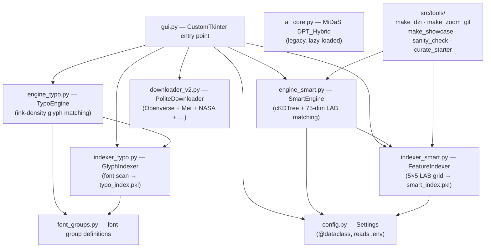

# Architecture

Neural-Mosaic is a desktop application that reconstructs photographs as high-resolution mosaics (up to 16K) assembled from thousands of real images or typographic glyphs. It consists of two independent rendering engines, a shared tile indexing layer, and a multi-source async downloader — all exposed through a single CustomTkinter GUI.

## Module Dependency Graph



## Key Modules

| Module | Role |
|---|---|
| `gui.py` | Entry point. Two tabs: *Smart Photo Mosaic* and *Symbol Mosaic (Typo)*. Spawns render threads, displays live log, manages index lifecycle. |
| `engine_smart.py` | Colour-matched photo mosaic engine. Loads `smart_index.pkl`, runs `cKDTree` nearest-neighbour search per tile sector, applies anti-repetition constraints, Color Blend, and Tile Tint. |
| `engine_typo.py` | Glyph mosaic engine. Maps each cell's mean brightness to the closest glyph by ink density; renders in `black_on_white`, `white_on_black`, or `color_on_white` mode. |
| `indexer_smart.py` | Encodes tile library as 75-dim LAB feature vectors (5×5 regional grid, 3 channels each) and serialises to `data/smart_index.pkl`. |
| `indexer_typo.py` | Pre-renders every glyph from every font in `assets/fonts/` and stores its normalised ink density in `data/typo_index.pkl`. |
| `downloader_v2.py` | Async multi-source downloader with per-source polite delays, perceptual-hash deduplication, blur/uniform-colour quality filter, and resume support. |
| `config.py` | `@dataclass` singleton `settings`; reads `.env` via `python-dotenv`. Key fields: `TILE_SIZE`, `TARGET_SHORT_SIDE`, `USE_CUDA`. |
| `font_groups.py` | Defines 7 thematic font groups (CJK, Ancient, Symbols, Latin, Decorative, Handwriting, Other) used by both the indexer and the GUI dropdown. |
| `ai_core.py` | Lazy-loaded MiDaS DPT_Hybrid singleton for depth estimation (legacy — retained for future depth-aware tile placement). |
| `src/tools/` | Standalone scripts: DZI pyramid builder, zoom GIF generator, showcase crop helper, sanity checker, starter library curator. |

## Data Flow

```
1. Download      downloader_v2.py  →  data/library_*/tiles/  (JPEG images)
2. Index         indexer_smart.py  →  data/smart_index.pkl   (75-dim LAB features)
                 indexer_typo.py   →  data/typo_index.pkl    (glyph densities)
3. Render        engine_smart.py   →  output/<name>_Smart_<ts>.jpg
                 engine_typo.py    →  output/<name>_Symbol_<ts>.png
4. Deep Zoom     make_dzi.py       →  docs/tiles/<name>.dzi + tile pyramid
                 make_all_tiles.py →  batch runner for multiple mosaics
5. Viewer        docs/index.html   →  GitHub Pages (OpenSeadragon)
```

## Design Decisions

- **LAB colour space over RGB** — perceptual uniformity means Euclidean distance in LAB correlates with perceived colour similarity, giving better matches than raw RGB.
- **5×5 regional grid** — captures spatial colour gradients within each tile (not just mean colour), preserving local structure without the GPU overhead of learned embeddings.
- **cKDTree** — O(log n) nearest-neighbour queries over 300 000+ tiles in milliseconds; no GPU required for the core matching loop.
- **Anti-repetition** — hard neighbour constraint (no tile from the same source image touches another) combined with a frequency penalty score prevents any single photograph from dominating the output.
- **No CLIP/VGG** — early versions used CLIP ViT-B/32 and VGG-19; replaced in v5 with direct LAB matching. Colour fidelity improved and VRAM requirement dropped to near zero.
