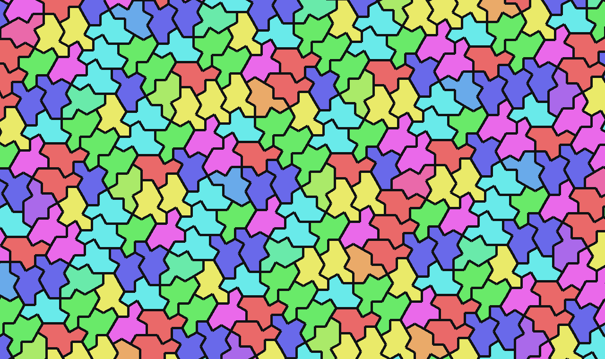
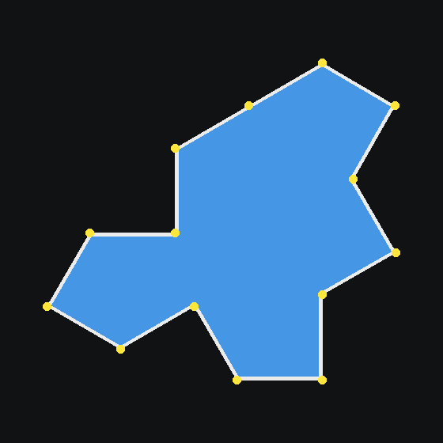
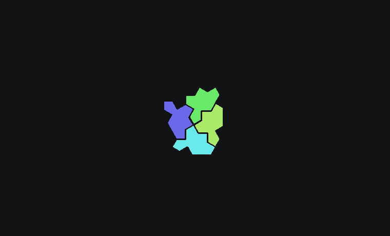

# Photomosaics on an aperiodic monotile

**English** · [Polski](aperiodic-monotile-mosaic.pl.md)

> Almost every photomosaic ever made sits on a square grid. [Neural-Mosaic](https://github.com/Piotr1686/Neural-Mosaic) can lay one out on the **spectre** — the chiral aperiodic monotile discovered in 2023 — a single shape that tiles the plane and *never repeats*.


*One tile shape, every orientation, no repeating grid. Colour here encodes each tile's rotation.*

## The shape

In 2023 a four-person team — David Smith, Joseph Myers, Craig Kaplan and Chaim Goodman-Strauss — settled a problem open since the 1960s: is there a *single* tile that covers the plane only **aperiodically**, with no repeating unit? Their first answer, the **"hat"** ([arXiv:2303.10798](https://arxiv.org/abs/2303.10798)), was an "einstein" (German *ein Stein*, "one stone"), but it needed reflected copies. Weeks later the same team published the **"spectre"** ([arXiv:2305.17743](https://arxiv.org/abs/2305.17743)): a 14-sided tile that is *strictly chiral* — it tiles aperiodically using only rotations and translations of one handedness, no mirror images required. The true single-tile einstein.


*The spectre: 14 edges of equal length. Neural-Mosaic uses the spectre only (the hat, which needs reflections, was dropped).*

## Why put a mosaic on it

A square grid imposes a periodic rhythm. The eye locks onto the rows and columns, and at a distance the lattice itself becomes a texture competing with the picture. An aperiodic tiling has plenty of *local* structure but **no global repeat**, so the grid never resolves into a pattern of its own — it reads as organic. Add black grout and the geometry becomes legible: step in and every irregular cell turns out to be a separate photograph.

It is also, simply, a real mathematical object from a landmark result — not a filter. That is the difference between "a nice app" and "something that does what nothing else does."


*The tiling grows outward from the centre. Notice there is no translational symmetry — no shift maps the pattern onto itself.*

## How it renders

The geometry lives in [`src/spectre_tiling.py`](https://github.com/Piotr1686/Neural-Mosaic/blob/main/src/spectre_tiling.py). `generate_spectre_tiling(width, height, tile_size)` produces an **exact** chiral spectre tiling via the published substitution system:

- **Deterministic** — identical arguments give an identical tiling.
- **Resolution-independent** — it covers any rectangle; each spectre's area ≈ `tile_size²`, so a spectre render has roughly the same tile count as a square render at the same setting (a fair comparison).
- **Strictly chiral** — every placement shares one handedness; boundary tiles overhang and are clipped by the caller.

Each 14-gon then becomes a tile *slot*, filled by the same machinery as the square engine: 5×5 LAB colour matching against the library, plus the anti-repetition penalty so no single photo dominates. Rendering each non-rectangular cell efficiently is its own problem — the masks are stored as polygons and rasterised lazily at composite time (`_LazyMask`), supersampled 4× with LANCZOS for clean edges and pinned by bit-exact golden tests. That work is written up in the [Performance Engineering](https://github.com/Piotr1686/Neural-Mosaic#performance) section.

## See it / try it

- **Live, zoomable:** the [interactive gallery](https://piotr1686.github.io/Neural-Mosaic/) hosts a full **16K** spectre mosaic — zoom from the whole portrait down to one photo in a single irregular cell.
- **Render your own:**
  ```bash
  python -m src.cli render input/portrait.jpg --engine smart --shape spectre --res 16K
  ```

---

*Tiling discovery: Smith, Myers, Kaplan & Goodman-Strauss, "A chiral aperiodic monotile" (2023), [arXiv:2305.17743](https://arxiv.org/abs/2305.17743). Implementation and images: [Neural-Mosaic](https://github.com/Piotr1686/Neural-Mosaic).*
